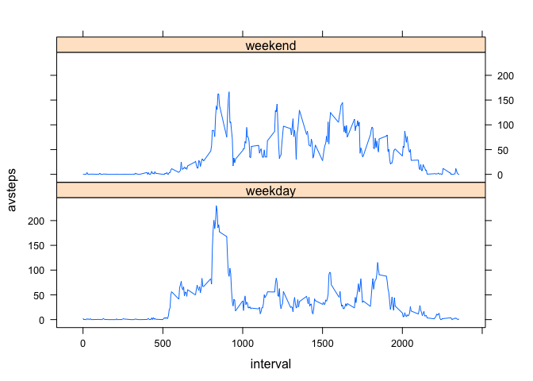

# Reproducable Research Assignment1
Joe Wisenbaker  
December 13, 2014  
This assignment makes use of data from a personal activity monitoring device. This device collects data at 5 minute intervals through out the day. The data consists of two months of data from an anonymous individual collected during the months of October and November, 2012 and include the number of steps taken in 5 minute intervals each day.

The following code reads in the raw data from the GitHub repository for the assignment and summarizes it by day for the first part of the assignment.


```r
Raw = read.csv(unz("activity.zip","activity.csv"))
ByDate=aggregate(Raw["steps"],by=Raw["date"],FUN=sum) 
```
##What are initial impressions of this data?

Ignoring missing data, here is a histogram of the total number of steps per day:


```r
hist(ByDate$steps,breaks=20)
```

 

Thus, the most frequently ocurring value for the number of steps per day for this individual seems to be just a little more than 10,000. There were a very few days with virtually no activity (perhaps due to the presence of missing data in this file) and a few with more than 20,000.

The mean and median number of steps taken were


```r
mean(ByDate$steps,na.rm=TRUE)
```

```
## [1] 10766
```

```r
median(ByDate$steps,na.rm=TRUE)
```

```
## [1] 10765
```

Looking at the mean number of steps by level of "interval" taken across days provides another picture of the activity levels of this individual as can be seen in the following time series plot:


```r
ByInterval=aggregate(Raw["steps"],by=Raw["interval"],FUN=mean, na.rm=TRUE)
attach(ByInterval)
plot(interval,steps,type = "l")
```

 

The time interval with the largest average number of steps was:

```r
ByInterval$interval[steps==max(steps)]
```

```
## [1] 835
```

Of course missing data in the sense of time intervals during which there was no recording of data, could have serious implications in terms of the way this data appears. The number of intervals for which the number of steps taken was missing was:

```r
Miss=Raw[is.na(Raw$steps),]
nrow(Miss)
```

```
## [1] 2304
```

The number of observations NOT missing information was:

```r
NMiss=Raw[!is.na(Raw$steps),]
nrow(NMiss)
```

```
## [1] 15264
```
From the perspective of the number of steps per day, missing values are effectively treated as zero.

One way this might be addressed is through the imputation of missing data. Here, I've chosen to do this by substituting the mean number of steps taken in a given time interval for the value missing for that time interval. The imputed data are then merged with observations having non-missing information and revised data summarizing things by date.


```r
i=1
while(i<=nrow(Miss))
{Miss$steps[i]=ByInterval$steps[ByInterval$interval==Miss$interval[i]]
 i=i+1}
RawImputed=rbind(Miss,NMiss)
Aimp = aggregate(RawImputed["steps"],by=RawImputed["date"],FUN=sum)
```
The histogram of the revised data where the mean substitution method was applied looks like:

```r
hist(Aimp$steps,breaks=20)
```

 

The revised mean and median number of steps per day are:

```r
mean(Aimp$steps)
```

```
## [1] 10766
```

```r
median(Aimp$steps)
```

```
## [1] 10766
```
Clearly, this seems to provide a somewhat different picture of the indiviual's activity level - making it look as though the indiviual's level of activity tended to be  more concentrated around 10,000 steps per day though with mean and median values fairly close to those in the original raw data.

##Are there differences in activity patterns between weekdays and weekends?

The following code takes the date field information for this individual and processes it to yield separate summaries based on whether each date was on a weekend or during the week.


```r
RawImputed$WeekDay = weekdays(as.Date(RawImputed$date))
RawImputed$WeekClass[RawImputed$WeekDay == "Saturday"] <- "weekend"
RawImputed$WeekClass[RawImputed$WeekDay == "Sunday"] <- "weekend"
RawImputed$WeekClass[RawImputed$WeekDay == "Monday"] <- "weekday"
RawImputed$WeekClass[RawImputed$WeekDay == "Tuesday"] <- "weekday"
RawImputed$WeekClass[RawImputed$WeekDay == "Wednesday"] <- "weekday"
RawImputed$WeekClass[RawImputed$WeekDay == "Thursday"] <- "weekday"
RawImputed$WeekClass[RawImputed$WeekDay == "Friday"] <- "weekday"
```

While not entirely appropriate from the standpoing of any formal, inferential 'test' of the equality of average number of steps per day between weekday and weekend, the descriptive information clearly suggest a greater degree of activity on the weekends.


```r
t.test(RawImputed$steps~RawImputed$WeekClass)
```

```
## 
## 	Welch Two Sample t-test
## 
## data:  RawImputed$steps by RawImputed$WeekClass
## t = -3.675, df = 7842, p-value = 0.0002398
## alternative hypothesis: true difference in means is not equal to 0
## 95 percent confidence interval:
##  -10.360  -3.152
## sample estimates:
## mean in group weekday mean in group weekend 
##                 35.61                 42.37
```

What follows is a panel plot containing a time series plot (i.e. type = "l") of the 5-minute interval (x-axis) and the average number of steps taken, averaged across all weekday days or weekend days (y-axis). The topmost graph displays this for weekends while the bottom does this for weekdays.


```r
attach(RawImputed)
```

```
## The following objects are masked from ByInterval:
## 
##     interval, steps
```

```r
ImpClassAv = aggregate(steps,by=list(interval,WeekClass),FUN=mean)
library(plyr)
ImpClassAv=rename(ImpClassAv,c("Group.1"="interval","Group.2"="WeekClass","x"="avsteps"))
attach(ImpClassAv)
```

```
## The following objects are masked from RawImputed:
## 
##     interval, WeekClass
## 
## The following object is masked from ByInterval:
## 
##     interval
```

```r
library(lattice)
xyplot(avsteps~interval |WeekClass,type = "l",layout=c(1,2))
```

 

It would seem these figures suggest that weekday activity tends to be markedly higher earlier in the day (consistent with the individual having less activity when at work) while weekend activity is far more distributed over the waking hours.
